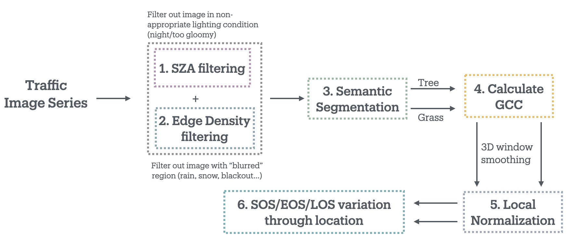
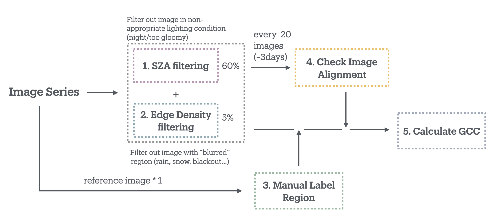

# Phenocam Code

A collection of scripts and tools for processing PhenoCam images, analyzing vegetation indices, and understanding seasonal metrics (Start of Season, End of Season, and Length of Season).  
The processing workflow includes both **auto-labeling** and **manual-labeling** pipelines.

---

## 📂 Project Structure
```bash
phenocam-code/
├── Auto_label/
│   ├── 1_auto_label_gcc_extraction.py          # Auto-labeling and extraction from time series of images
│   ├── Traffic Camera List - 4326.csv          # Traffic camera location and index for the city of Toronto
│   └── 2_plot_raw_curve/
│       ├── plot_one_month.py                   # Plot raw GCC for one month at one site
│       └── plot_multiple_month.py              # Plot raw GCC for one year at one site
│   └── 3_key_index_extract/
│       └── map_prepare.py                      # Prepare each site's full-year normalized GCC time series with key indices
│   └── 4_plot_map/
│       ├── metrics_map.py                      # Plot maps of SOS/EOS/LOS/peakdate with color bars
│       └── gif_continuous_field_map.py         # Interpolate discrete site measurements to continuous GCC maps
├── Manual_label/
│   ├── manual_label.ipynb                      # Jupyter notebook explaining the manual labeling workflow
│   └── full_code/
│      └── with_transformation/                 # Pipeline with projective transformation
│           ├── 1_image_alignment_projective.py
│           ├── 2_manual_label_readin.py               
│           └── 3_gcc.py
│      └── without_transformation/              # Pipeline without transformation
│           ├── 1_manual_label_readin.py               
│           └── 2_gcc.py
│   └── figures/                                # Figures for the Jupyter notebook
└── README.md                                   # Project documentation
```


## Auto-Labeling

The **Auto-labeling pipeline** extracts vegetation indices (GCC) directly from traffic camera time series without manual intervention.  

### Workflow
1. **GCC Extraction**  
   Run `1_auto_label_gcc_extraction.py` to extract GCC values from image sequences.  

2. **Raw Curve Plotting**  
   - `plot_one_month.py`: plot raw GCC for one month at a single site.  
   - `plot_multiple_month.py`: plot raw GCC for a full year at a single site.  

3. **Key Index Preparation**  
   Use `map_prepare.py` to normalize GCC time series and compute seasonal indices (SOS, EOS, LOS, peak date).  

4. **Map Visualization**  
   - `metrics_map.py`: plot site-based maps of SOS/EOS/LOS/peak date with color bars.  
   - `gif_continuous_field_map.py`: interpolate discrete site measurements into continuous maps and create animations.  

This pipeline is designed for large-scale, automated processing across multiple sites.


## Manual Labeling

The **Manual-labeling pipeline** provides more control and accuracy by allowing manual input during site calibration.  

### Workflow
1. **Jupyter Notebook Overview**  
   Start with `manual_label.ipynb`, which documents the methodology and provides examples.  

2. **Pipeline Variants**  
   - **With Transformation:**  
     Includes projective image alignment before labeling.  
     Scripts:  
       - `1_image_alignment_projective.py`  
       - `2_manual_label_readin.py`  
       - `3_gcc.py`  
   - **Without Transformation:**  
     Direct labeling workflow without geometric correction.  
     Scripts:  
       - `1_manual_label_readin.py`  
       - `2_gcc.py`  

3. **Supporting Materials**  
   Example figures for reference are stored in the `figures/` directory.  

This workflow is best suited for **detailed case studies** and for validating automated methods.
